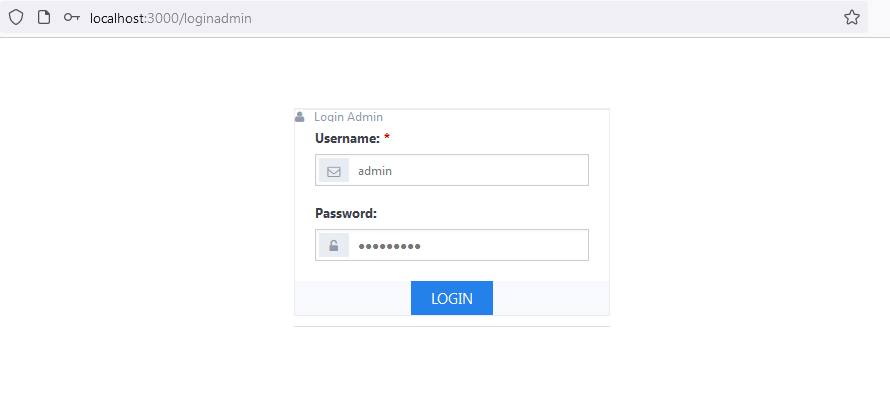
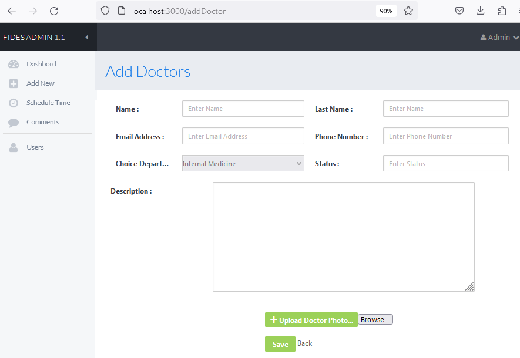
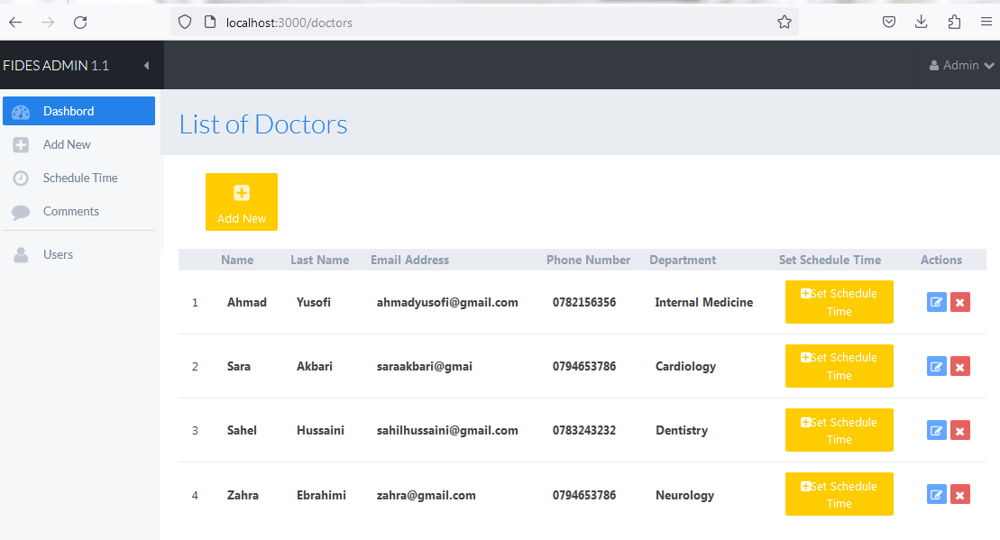
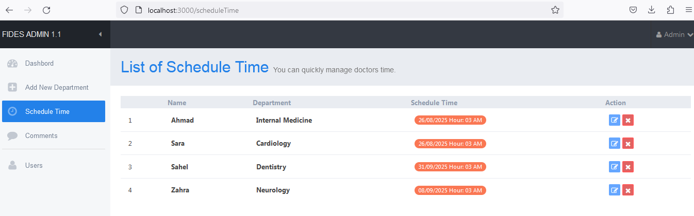
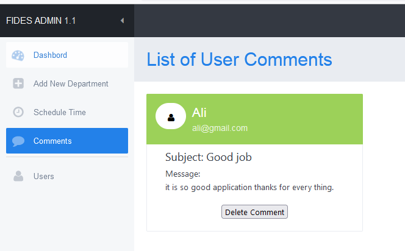
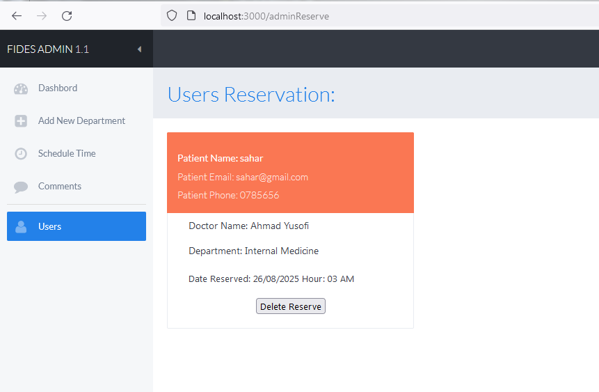
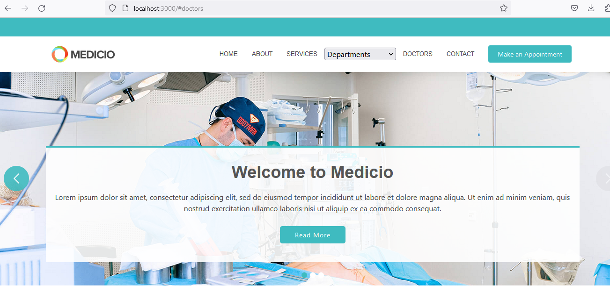
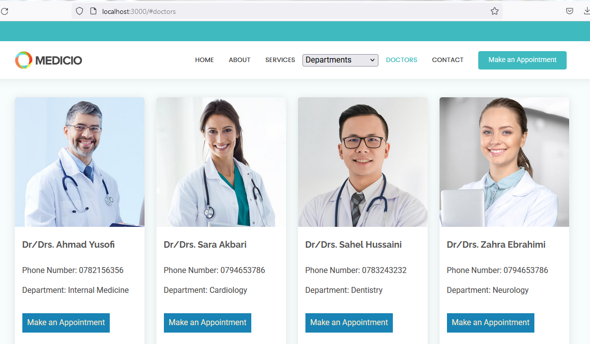
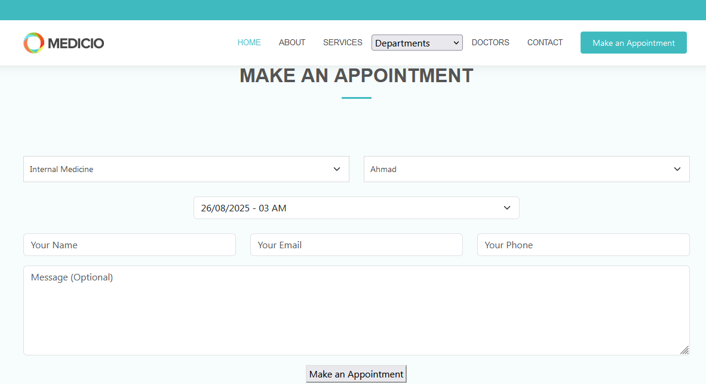

# Doctor Reservation System

A full-stack web application for doctor appointment booking.  
The system includes an **Admin Panel** and a **User Panel** with complete management and reservation features.

---

## 👨‍⚕️ Admin Features
- Add, edit, and delete doctors  
- Manage doctor schedules (set available time slots)  
- View and manage user reservations  
- Manage user comments and suggestions  

## 👩‍💻 User Features
- View doctor list and details  
- Book an appointment with a doctor  
- Leave comments and suggestions about doctors
  ---

## 🛠️ Technologies Used
- **Backend:** Node.js, Express.js, MongoDB  
- **Frontend:** HTML, CSS, Bootstrap, Vue.js, EJS  
- **Other Tools:** Git & GitHub  

---
📷 Screenshots

##Here are some screenshots of the system:

Login Page – Admin login interface


Add Doctor Page – Admin can add a new doctor


Admin Dashboard – View all doctors with details also Add and Manage doctors, schedules, and reservations.


Admin can set and edit schedules time for doctors


Admin view and delete users comment.


Admin can view user Reservation and delete it.


Main Page

Doctor Details Page – Shows doctor’s profile and schedule

Reservation Page – User can book a doctor’s appointment
Feedback Page – Users can leave comments and suggestions


---

## 🚀 Installation & Run
```bash
# Clone the repository
git clone https://github.com/SakinaEbrahimi/DoctorReservation.git

# Go to the project directory
cd DoctorReservation

# Install dependencies
npm install

# Run the application
npm start
